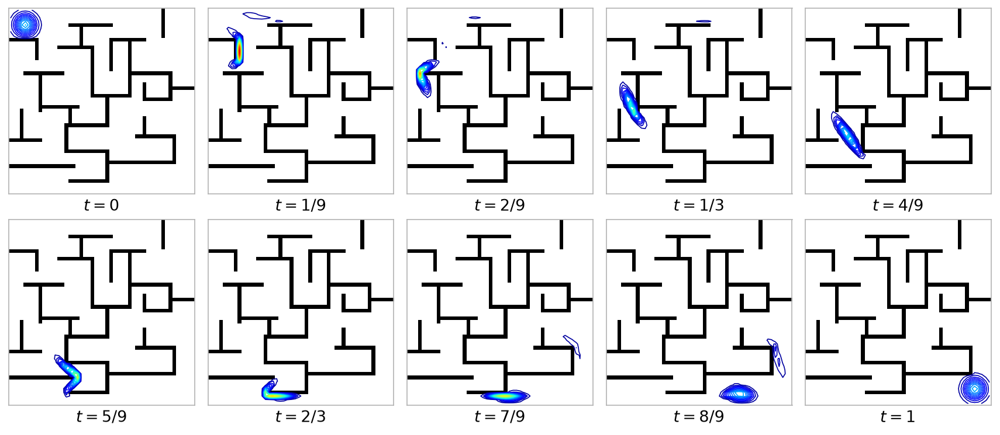

# Optimal Transport with Proximal Splitting — Python 再現実装

以下の論文の数値実験(迷路内の動的最適輸送)を Python で再現するリポジトリです。原著者による MATLAB 実装(`code/`)と論文原稿(`paper/`)を参照資料として同梱し、そのコア部分を `src/ot_splitting/` に移植しています。

> N. Papadakis, G. Peyré, E. Oudet. [Optimal Transport with Proximal Splitting](https://hal.archives-ouvertes.fr/hal-00816211). *SIAM Journal on Imaging Sciences*, 7(1), pp. 212–238, 2014.

再現結果(`out/evolution.png`):迷路を障害物として、左上のガウシアンが右下へ輸送される様子の等高線モンタージュです。



参照元となる論文の図は [`img/evolution.png`](img/evolution.png) です。

## 問題設定

2 つの確率密度 `f0`(初期)と `f1`(最終)の間の L² Wasserstein 測地線(時間発展する密度の補間)を計算します。Benamou–Brenier 定式化では、最適輸送は次のエネルギー最小化問題として書けます。

```
min_{f,m}  ∫∫ |m(x,t)|² / f(x,t) dx dt
s.t.       ∂t f + div(m) = 0,   f(·,0) = f0,   f(·,1) = f1
```

この問題を時空間のスタガード格子(staggered grid)上で離散化し、大規模凸最適化問題として近接分離法(proximal splitting)で解きます。エネルギー項 J、発散ゼロ制約、スタガード格子と中心格子の補間整合制約という 3 つの近接作用素を、PPXA(並列 Douglas–Rachford)で並列に分離します。

## Python 再現の範囲

MATLAB 版 `test_bb_dr.m` の 'obstacle' テストケースの再現を目標としています。

- **ソルバ**: Douglas–Rachford(PPXA)のみ。Primal–Dual 版(`test_bb_pd.m`)はスコープ外
- **コスト**: `alpha = 1`(通常の L² Wasserstein)のみ
- **問題**: `code/Labyrinthe.png` の迷路(50×50、赤チャネル 0 の画素が壁)を障害物として、(.08, .08) から (.92, .92) へガウシアンを輸送。時間離散化は Q = 100

移植の設計・MATLAB との対応表は [`docs/matlab_to_python.md`](docs/matlab_to_python.md) を参照してください。

## 使い方

依存管理は [uv](https://docs.astral.sh/uv/) を使用します(Python 3.13 以上)。

```bash
# 'obstacle' ケースを解いて out/evolution.png を出力
uv run python -m ot_splitting.run_obstacle
```

オプション:

```bash
uv run python -m ot_splitting.run_obstacle \
    --niter 2000 \          # 反復回数
    --gamma 0.004348 \      # prox のステップ(既定 1/230)
    --mu 1.98 \             # 緩和パラメータ、区間 ]0,2[ 内
    --maze code/Labyrinthe.png \  # 迷路画像(赤チャネル 0 を壁とみなす)
    --output out/evolution.png
```

テストの実行:

```bash
uv run pytest
```

## ディレクトリ構成

```
.
├── src/ot_splitting/         Python 再現実装
│   ├── grid.py               Staggered クラス(スタガード格子データ)
│   ├── operators.py          div, interp(格子間の変換)
│   ├── poisson.py            DCT による Neumann 境界 Poisson ソルバ
│   ├── projections.py        発散ゼロ射影・補間整合射影
│   ├── prox.py               BB エネルギー J の近接作用素(Cardano の公式)
│   ├── solver.py             PPXA(並列 Douglas–Rachford)反復
│   ├── problems.py           テストケース定義(f0, f1, obstacle の生成)
│   ├── viz.py                等高線モンタージュの描画
│   └── run_obstacle.py       エントリポイント
├── tests/                    単体テスト(pytest)
├── docs/matlab_to_python.md  移植計画と MATLAB → Python 対応表
├── out/                      再現結果の出力
├── code/                     原著者による MATLAB ソースコード(参照用)
├── paper/                    論文の LaTeX 原稿一式(ProxOT.pdf 含む)
└── img/                      参照元の論文図
```

## 実装のポイント

- **スタガード格子**:密度と運動量を格子のずれた位置に配置する `Staggered` クラス(`grid.py`)を定義し、連続の式 `∂t f + div(m) = 0` を精度よく離散化しています。中心格子上の変数とは `interp` で相互変換します。
- **発散射影**:発散ゼロ制約への射影は Neumann 境界条件付き Poisson 方程式を `scipy.fft.dctn` ベースで解いて行います(`poisson.py`)。
- **prox_J の計算**:BB エネルギーの近接作用素は各格子点で 3 次多項式の正実根を求める計算に帰着されます。全格子点(約 250 万点/反復)を Cardano の公式でベクトル化して一括計算します(`prox.py`)。

## 原著の MATLAB 実装(`code/`)

MATLAB で `code/` ディレクトリに移動し、いずれかのデモを実行します(追加ツールボックス不要)。

```matlab
cd code
test_bb_dr   % Douglas–Rachford (PPXA) 版
test_bb_pd   % Primal–Dual 版
```

スクリプト冒頭の変数でテストケース(`'gaussian' | 'mixture' | 'obsession' | 'obstacle'`)、格子サイズ `N, P, Q`、一般化コストの指数 `alpha ∈ [0,1]`(1: L²-Wasserstein、0: H⁻¹)、反復回数などを変更できます。計算後に `animation_matlab.m` を実行すると、結果 `U` から等高線アニメーション用フレームを作成できます。詳細は各スクリプトのコメントを参照してください。

## ライセンス・著作権

このリポジトリは由来の異なる 2 種類の成果物を含みます。

- **MATLAB ソースコード(`code/`)・論文原稿(`paper/`)・図(`img/`)** — 原著者による既存の成果物です。
  Copyright (c) 2013 Nicolas Papadakis, Gabriel Peyré, Édouard Oudet
- **Python 移植(`src/`, `tests/` および関連プロジェクトファイル)** — wakabame による再現実装です。
  Copyright (c) 2026 wakabame([MIT License](LICENSE))
